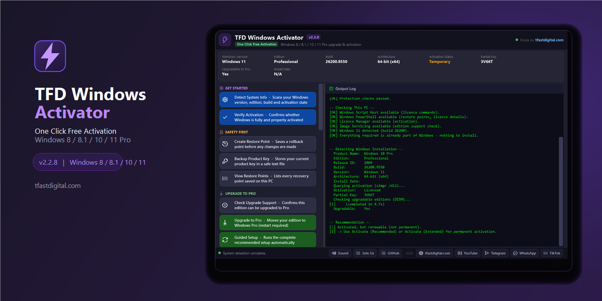
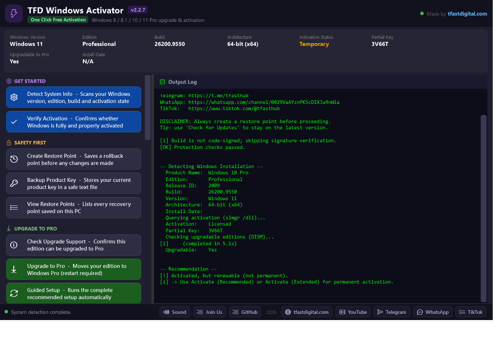
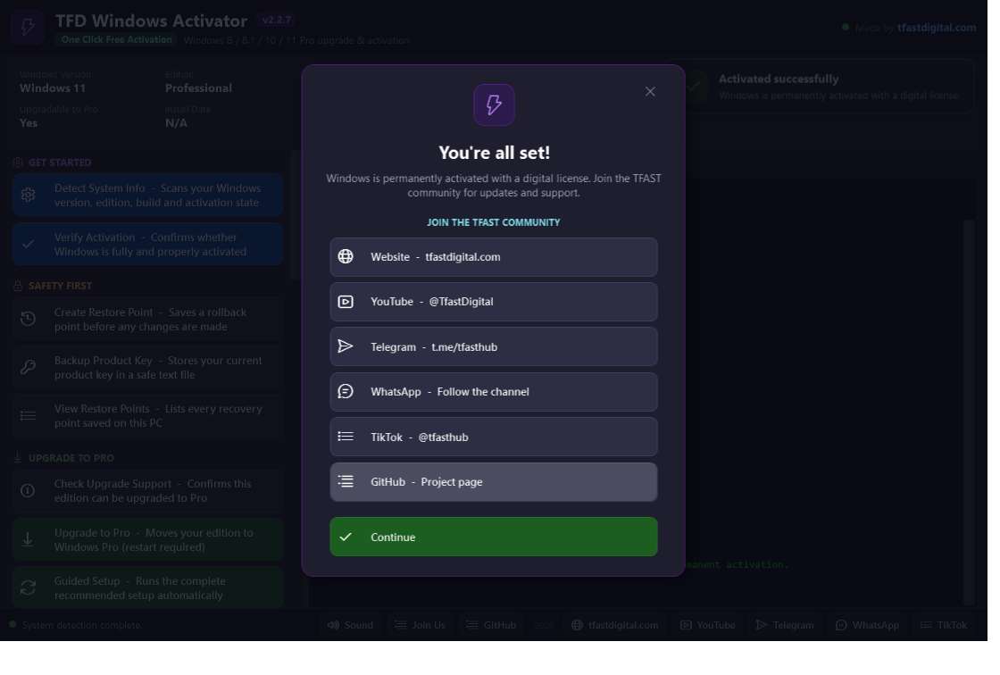
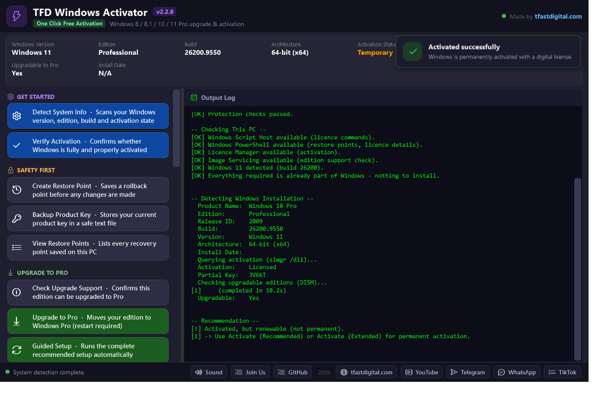
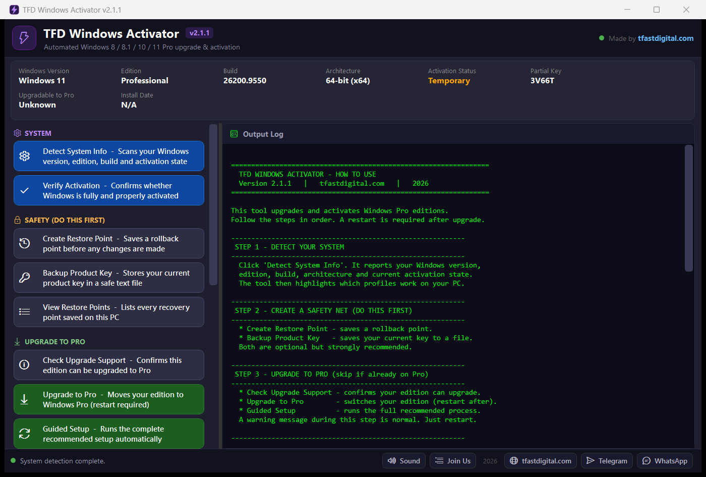

  

<h1 align="center">TFD Windows Activator</h1>

  <strong>Version 2.2.3</strong> &nbsp;·&nbsp; Windows 8 / 8.1 / 10 / 11 &nbsp;·&nbsp;
  by <a href="https://tfastdigital.com">TFAST Digital Agency</a>

  

A clean, professional desktop application that upgrades and activates Windows Pro
editions with a single click. No command line, no scripts to write — just pick an
option and follow the on-screen guidance.

---

## Screenshots

**Main window — system detection, activation profiles and a live output log**

**Success popup with community links, shown when activation succeeds**

**Toast notifications for success and failure, with optional sounds**

**Built-in step-by-step guide, tailored to each Windows version**

---

## Overview

TFD Windows Activator gives you a simple, safe and guided way to:

- **Detect** your Windows version, edition, build and activation state
- **Protect** yourself with a restore point and a product-key backup
- **Upgrade** eligible editions to Windows Pro
- **Activate** Windows with a choice of activation profiles
- **Repair** activation, inspect licence details and clear stale notices
- **Brand** the activation with TFAST Digital Agency and keep the tool to re-activate later
- **Verify** that Windows is fully and properly activated
- **Get alerted** with sounds and on-screen notifications on success or failure
- **Run safely** — only one copy can run at a time, with clear error reporting
- **Stay current** with built-in one-click updates from GitHub

Everything runs locally on your PC. The tool shows you exactly what it is doing
in real time in the **Output Log**.

---

## Download

1. Open the **Releases** page of this repository.
2. Download the latest **`TFDWindowsActivator.exe`**.
3. Run it — Windows will ask for administrator permission. **Allow it.**

> Only the official `.exe` from the Releases page is supported. Always use the
> newest version.

---

## Requirements

| | |
|---|---|
| **OS** | Windows 8, 8.1, 10 or 11 (Pro upgrade target) |
| **Privileges** | Administrator (the app requests this automatically) |
| **Disk** | A few MB |
| **Internet** | Needed for activation and for update checks |
| **Account** | A Microsoft account for the *Recommended* activation profile only |

---

## Quick Start

1. **Run the app** and allow administrator access.
2. Click **Detect System Info** — confirm your Windows version and edition.
3. Click **Create Restore Point** — your safety net.
4. Click **Backup Product Key** — keeps your current key safe.
5. If you are **not** already on Pro, click **Upgrade to Pro** and restart.
6. Click an **activation profile** that matches your Windows version.
7. Click **Verify Activation** to confirm everything worked.

---

## How to Use — by Windows Version

### Windows 11
1. **Detect System Info** → confirm *Windows 11* and your edition.
2. **Create Restore Point** and **Backup Product Key**.
3. If needed, **Upgrade to Pro**, then restart.
4. Activate with **Activate (Recommended)** — this is the permanent option.
   Sign in with a Microsoft account if prompted.
5. If *Recommended* is unavailable, use **Activate (Extended)**.
6. **Verify Activation**.

### Windows 10
1. **Detect System Info** → confirm *Windows 10* and your edition.
2. **Create Restore Point** and **Backup Product Key**.
3. If needed, **Upgrade to Pro**, then restart.
4. Activate with **Activate (Recommended)** (permanent), or
   **Activate (Extended)** (long-term, no account required).
5. **Verify Activation**.

### Windows 8.1
1. **Detect System Info** → confirm *Windows 8.1* and your edition.
2. **Create Restore Point** and **Backup Product Key**.
3. If needed, **Upgrade to Pro**, then restart.
4. Activate with **Activate (Universal)** — renews automatically — or
   **Activate (Standard)**.
5. **Verify Activation**.

### Windows 8
1. **Detect System Info** → confirm *Windows 8* and your edition.
2. **Create Restore Point** and **Backup Product Key**.
3. If needed, **Upgrade to Pro**, then restart.
4. Activate with **Activate (Universal)** — renews automatically — or
   **Activate (Standard)**.
5. **Verify Activation**.

> **Which profile first?** *Recommended → Extended → Universal → Standard →
> Alternative.* Start at the top and move down only if a profile is not
> suitable for your Windows version or does not confirm.

---

## Verifying Activation

Click **Verify Activation**. The tool runs several independent checks and gives
you a clear verdict:

- **Permanently activated** — nothing to do.
- **Activated (renewable)** — working, but consider a permanent profile.
- **Not activated** — pick a profile and try again.

---

## Notifications and Sounds

- **On success** — a pleasant chime, a green toast notification, and a
  **Join Us** popup with the TFAST community links.
- **On failure** — an alert tone and a red toast with a clear message.
- **Sound on/off** — click **Sound** in the footer to mute or unmute at any time.

---

## Activation Tools

- **Repair Activation** — re-registers the licence and restarts the licensing
  services.
- **License Details** — shows status, channel and expiry.
- **Clear Notices** — restarts Explorer to clear stale activation notices.

## System & Branding

- **Keep On This PC** — installs the tool to a permanent location and creates
  Start Menu / Desktop shortcuts, so you can **re-activate any time**.
- **TFD Branding** — records TFAST Digital Agency in this PC's activation / about
  information, so it is visible that **TFD activated this PC**.
- **Activation Record** — shows who activated this PC and when.

---

## Diagnostics & Feedback

- **Diagnostics** — prints a technical snapshot (OS, runtime, admin state,
  detection results) to the log.
- **Copy Log** / **Save Log** — grab the full session log to send to support.
- **Open Log Folder** — opens the folder containing `error.log`.

If something unexpected happens, the app writes details to
`%LOCALAPPDATA%\TFAST\WindowsActivator\error.log` and shows a clear message
instead of closing silently.

**Only one instance** of the tool can run at a time — launching it again brings
the existing window to the front.

---

## Rolling Back

If you want to undo the upgrade:

1. Click **View Restore Points** to see your saved points.
2. Open **Settings → System → About → System protection → System Restore**.
3. Restore to the point named *WindowsActivator Pre-Activation*.

Your original product key is also saved in `windows_key_backup.txt` next to the
application.

---

## Staying Up to Date

Click **Check for Updates**. The app compares your version with the newest release
on GitHub and, if a newer build exists, downloads and installs it automatically,
then restarts itself.

---

## Troubleshooting

| Problem | Solution |
|---|---|
| "Your Windows license will expire soon" | Re-run **Universal** or **Standard**, or switch to a permanent profile. |
| Activation not confirmed | Try a different profile, starting from **Recommended**. |
| A "SKU value" notice appears | This is normal for **Recommended** — activation still completes. |
| Update check fails | Check your internet connection and try again later. |
| The app won't start | Right-click it → **Run as administrator**. |

---

## FAQ

**Is this safe?**
The tool creates a restore point and backs up your key before making changes, so
you can always roll back.

**Do I need to restart?**
Only after the **Upgrade to Pro** step.

**Do I need a Microsoft account?**
Only for **Activate (Recommended)**.

**Will updates overwrite my settings?**
No. Your restore points and key backup are kept.

---

## Version Notes

See [CHANGELOG.md](CHANGELOG.md) for the full history.

**v2.2.3**
- Cleaner, better organised action panel with clearer groups.
- New presentation artwork.

**v2.2.2**
- Only one instance can run at a time; a second launch focuses the existing window.
- Global error handling with `error.log` and a clear on-screen message.
- Diagnostics, Copy Log, Save Log and Open Log Folder actions.
- Command runner now enforces timeouts and reports exit codes.

**v2.2.1**
- Publisher metadata corrected to **TFAST Digital Agency**.

**v2.2.0**
- Sound effects on success and failure, with a Sound on/off toggle.
- Toast notifications for success and failure.
- Join Us popup on successful activation, with community links.
- Activation tools: Repair Activation, License Details, Clear Notices.
- System & branding: Keep On This PC, TFD Branding, Activation Record.
- Terms & Conditions added ([TERMS.md](TERMS.md)).

**v2.1.1**
- Fixed the window title to show the correct version.

**v2.1.0**
- New **Check for Updates** — automatic download and install from GitHub Releases.
- Professional, streamlined interface with clearly named actions.
- Help & usage guide covering each Windows version.
- Responsive layout that fits small screens and laptops.

**v2.0.0**
- Complete visual redesign of the desktop app.

---

## Support

- **Website:** https://tfastdigital.com
- **Telegram:** https://t.me/tfasthub
- **WhatsApp:** https://whatsapp.com/channel/0029VaAYznPK5cDIXJa9nW1a

---

## Disclaimer

This software is provided "as is", without warranty of any kind. You are
responsible for how you use it and for complying with the laws and licence terms
that apply to you. Always keep a restore point and a product-key backup.

See [TERMS.md](TERMS.md) for the full terms and conditions.

© 2026 TFAST Digital Agency.

